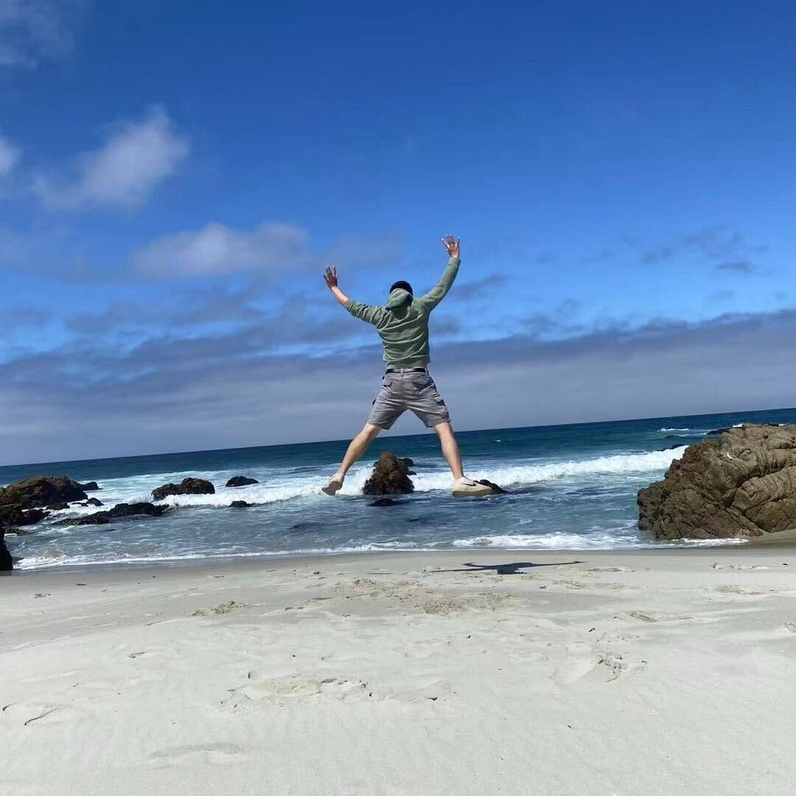

# Hello, I'm Chao 👋

Welcome to my GitHub Pages website!

## About Me
I am a Postdoc Scholar at Uchicago working on cancer genomics, machine learning and statistics. Recently I have been studying Rust and plan to host my webpage on my local server soon!!

## ML Projects
- [Project 1](https://github.com/wangc90/AE_Data_Integration)
- [Project 2](https://github.com/wangc90/CircCNNs)

## Publications
- [Wang, C. and O’Connell, Michael J. (2025) Autoencoders with shared and specific embeddings for multi-omic data integration. BMC Bioinformatics](https://bmcbioinformatics.biomedcentral.com/articles/10.1186/s12859-025-06245-7)

- [Wang, C. and Liang, C. (2025) Dysregulation of locus-specific repetitive elements in TCGA pan-cancers. Genes](https://www.mdpi.com/2073-4425/16/5/528)

- [Wang, C. and Liang, C. (2024) CircCNNs, a convolutional neural network framework to better understand the biogenesis of exonic circRNAs. Sci. Rep.](https://www.nature.com/articles/s41598-024-69262-1)

- [Wang, C. and Liang, C. (2022) The insertion and dysregulation of transposable elements in osteosarcoma and their association with patient event-free survival. Sci. Rep.](https://www.nature.com/articles/s41598-021-04208-5)

## Awards
- Outstanding scholarship with a Comer-Reynolds Award. Department of Statistics, Miami University (2024)
- Outstanding scholarship with an ENAR Membership. Department of Statistics, Miami University (2024)

## Contact
Email: [wangc90@uchicago.edu](mailto:wangc90@uchicago.edu)

Linkedin: [https://www.linkedin.com/in/chao-wang-92a099210/](https://www.linkedin.com/in/chao-wang-92a099210/) 
